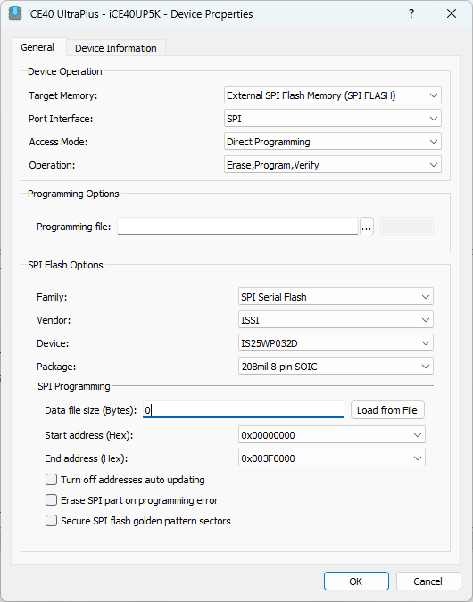

# VNA_FPGA_DSP

This repository contains the Verilog code and FPGA configuration files for implementing a phase detector, amplitude detector, and RBW (Resolution Bandwidth) filter in the VNA (Vector Network Analyzer) project. Designed for use with Lattice Radiant tools, the project provides flexible FPGA-based signal processing components that can be adapted for various configurations.  
___

## The open source 8-16 GHz VNA project  
Of course, this is built for the open source 8-16 GHz project (my master's thesis), so you can find all the associated resources in the following repositories:
- [Hardware repository](https://github.com/MysteriousWolf/VNA_Hardware)
- [Firmware repository](https://github.com/MysteriousWolf/VNA_Firmware)
- [FPGA Config repository](https://github.com/MysteriousWolf/VNA_FPGA_DSP/) (this one)

## Programming
You can program using the Radiant's included programming tools. The programmer config is included and should (with the exception of binary path, which can be found in the impl_1 folder after running the implementation) be ready out of the box to work with the [Lattice LSO programmer](https://github.com/aljazblatnik/GPS-receiver/tree/main/development%20tools/FPGA/FPGA%20programmer) or any HW-USBN-2B variant with 3.3 V voltage level.

In case config gets corrupted, here is a screenshot of all the relevant settings:

In words: Target Memory`External SPI Flash Memmory (SPI FLASH)` Vendor: `ISSI`, Device: `IS25WP032D`, Package: `208mil 8-pin SOIC`.

The rest can be left on defaults.

## Documentation
### SPI registry maps  
You can find the registry maps [here](resources/registry_map.md).
